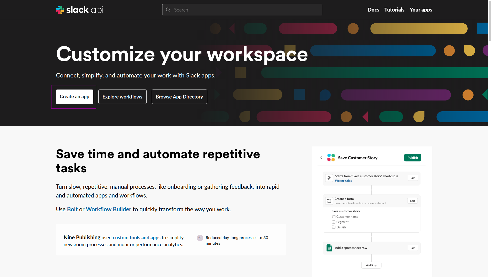
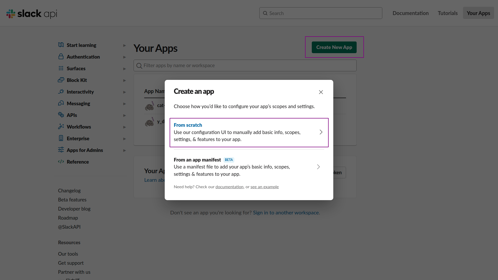
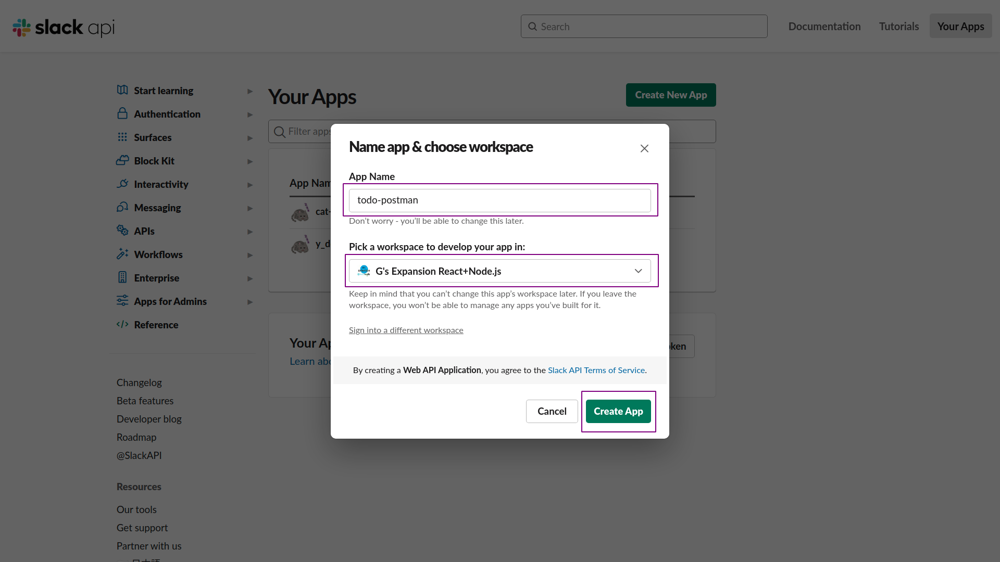
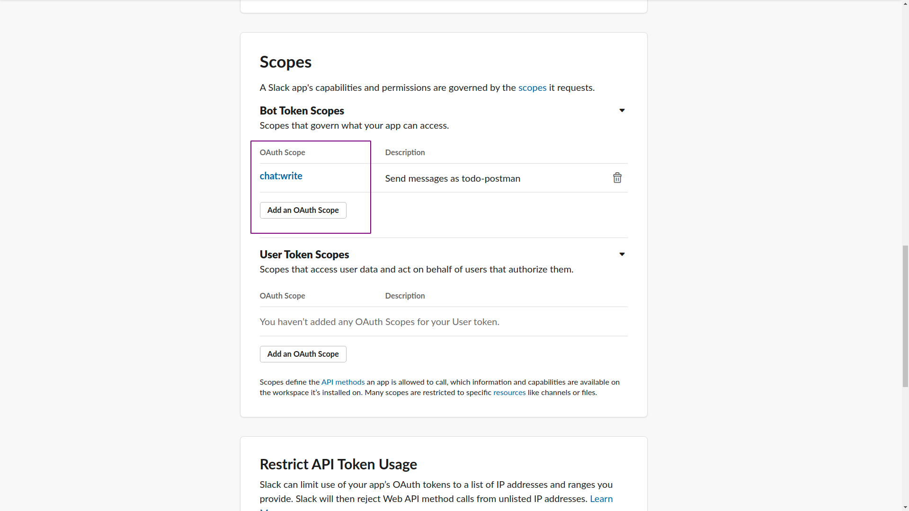
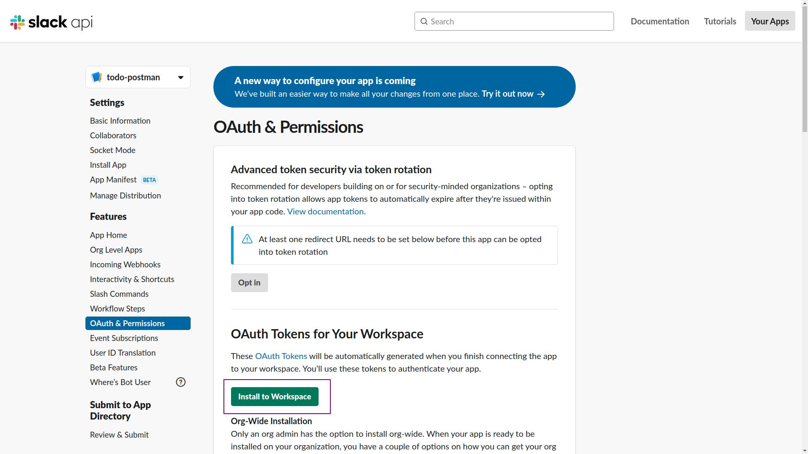
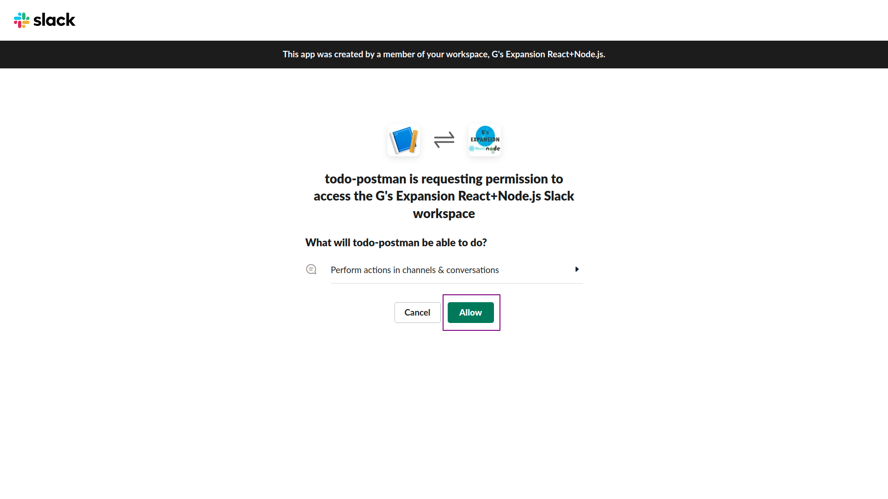
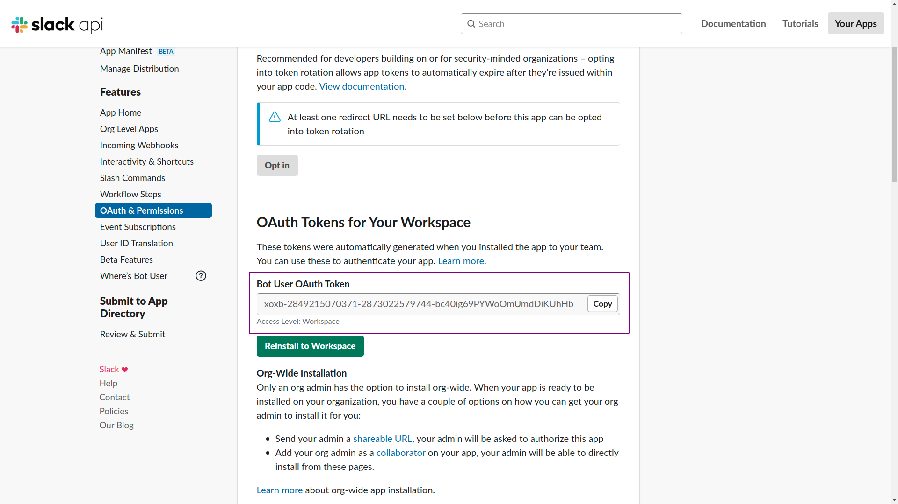
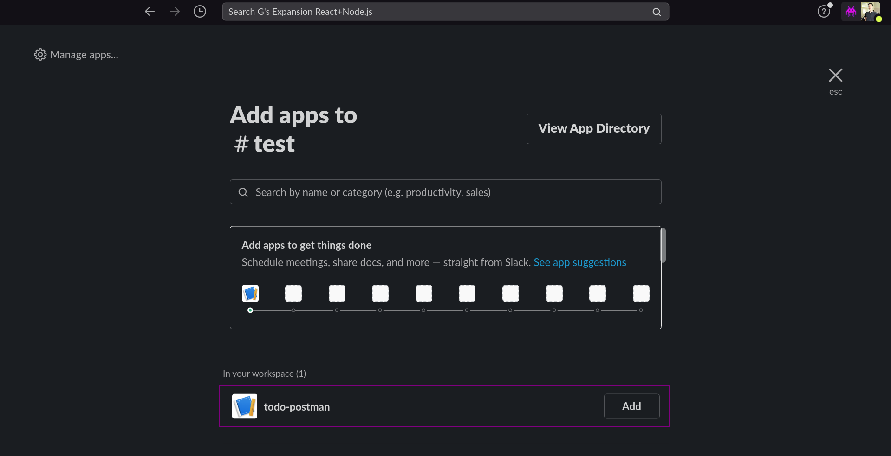

# Slack 連携設定

本項（と次の項）では，Slack で bot を作成し，todo の内容を投稿してもらう処理を実装する．

### STEP 1

まずは，以下 2 つのエンドポイントを作成して手動で実行する処理をつくる．

- todo リスト全件のデータを取得して Slack に投稿する．

- 実行日以前のデータのみ取得して Slack に投稿する．

### STEP 2

上記の処理を利用し，指定した時間で定期実行するように処理を拡張する．

## Slack と連携するための設定

下記 URL にアクセスする．

[https://api.slack.com/](https://api.slack.com/)

`Create an app` をクリック．



`From scratch` を選択．



「アプリ名（任意）」と「使用するワークスペース」を選択して `Create App` をクリック．



画面が変わるので，左側のメニューから `OAuth & Permissions` → `Scopes` 部分の `Bot Token Scopes` を `chat:write` に設定する．



`Install Workspace` がクリックできるようになっているのでクリックする．画面が変わったら `Allow` をクリック．





画面が変わるので `Bot User Access Token` をメモしておく．



Slack アプリ側で Bot を追加したい channel で「右上のメンバーボタン」→「Integrations」→ `Add an App` の順に進む．


作成したアプリ部分の `Add` ボタンをクリックする．



これでアプリ側の設定は完了．

## Token を環境変数に設定

`.env` ファイルに `Bot User Access Token` を記述しておく．

```txt
SUPABASE_API_KEY=hogefugapiyofoobar.eyJyb2xlIjoiYW5vbiIsImlhdCI6MTYzODc3MDU0NCwiZXhwIjoxOTU0MzQ2NTQ0fQ.FM4MwMd8wbPDGbXtnGfsn6bGSgMzBLdHOMGWRwhoK2I
SUPABASE_URL=https://hogehoge.supabase.co

SLACK_API_TOKEN=`取得した Bot User OAuth Token`
```
