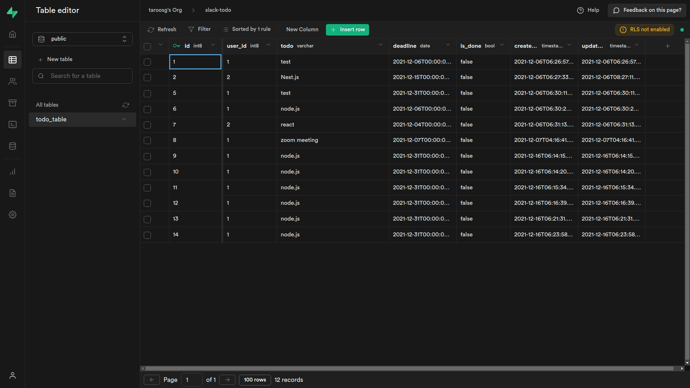

# Create の処理

## Create 処理の流れ

はじめは Create の処理を実装する．クライアントから送信されたデータを DB に保存する一連の流れを書く．

今回は`POST`メソッドでデータを送信し，新規レコードを作成する．

## ルーティングの作成

ルーティングでは，collection 名とデータを受け取り，コントローラにデータを渡す．

```js
// routes/todo.route.js

import express from "express";
// 🔽 編集
import {
  readAllTodoData,
  createTodoData,
} from "../controllers/todo.controller.js";

export const todoRouter = express.Router();

todoRouter.get("/", (req, res) => readAllTodoData(req, res));
// 🔽 追加
todoRouter.post("/", (req, res) => createTodoData(req, res));
```

## コントローラの作成

コントローラでは，データを整理してサービスに渡す．また，サービスの処理結果を元にレスポンスを返す．

```js
// controllers/todo.controller.js

// 🔽 編集
import { getAllTodoData, insertTodoData } from "../services/todo.service.js";

export const readAllTodoData = async (req, res, next) => {
  // 省略
};

// 🔽 追加
export const createTodoData = async (req, res, next) => {
  try {
    const { todo, deadline, user_id } = req.body;
    if (!(todo && deadline && user_id)) {
      throw new Error("something is blank");
    }
    const result = await insertTodoData({
      params: { todo: todo, deadline: deadline, user_id: Number(user_id) },
    });
    return res.status(200).json({
      status: 200,
      result: result,
      message: "Successfully post Todo Data!",
    });
  } catch (e) {
    return res.status(400).json({ status: 400, message: e.message });
  }
};
```

## サービスの作成

サービスではロジックが必要な場合は記述するが，今回はデータをそのまま渡すだけ．実際に Supabase にデータを保存する処理は `repositories` レイヤーに分割する．

```js
// services/todo.service.js

// 🔽 編集
import { findAll, store } from "../repositories/todo.repository.js";

export const getAllTodoData = async () => {
  // 省略
};

// 🔽 追加
export const insertTodoData = async ({ params }) => {
  try {
    return await store({ params });
  } catch (e) {
    throw Error("Error while posting Todo Data");
  }
};
```

## リポジトリの作成

テーブルを指定してデータを保存する処理を実装する．ここで Supabase 関連のコードを記述する必要があるため，関連するコードを import する．

データ永続化に関するコードをリポジトリのレイヤーに閉じ込めることで，DB の種類が変更された場合にもコントローラやサービスのコードに影響ない状態にすることができる．

ポイントは以下のとおり．

- `dotenv` で環境変数を読み込む．

- `createClient` で Supabase との連携を確立する．

- `insert()` でデータを作成する．

- `created_at`と`updated_at`は Supabase 側で初期値（現在日時）を設定しているため投稿不要．

参考：[https://supabase.com/docs/reference/javascript/insert](https://supabase.com/docs/reference/javascript/insert)

```js
// repositories/todo.repository.js

import dotenv from "dotenv";
import { createClient } from "@supabase/supabase-js";

dotenv.config();

const supabase = createClient(
  process.env.SUPABASE_URL,
  process.env.SUPABASE_API_KEY
);

export const findAll = () => {
  return { message: "OK" };
};

export const store = async ({ params }) => {
  try {
    const { data, error } = await supabase.from("todo_table").insert([
      {
        ...params,
        is_done: false,
      },
    ]);
    return data;
  } catch (e) {
    throw Error("Error while store Todo Data");
  }
};
```

## 動作確認

処理を追加したら動作確認する．サーバを起動して下記コマンドでデータを送信し，成功のレスポンスが返ってくれば OK．

```bash
$ curl -X POST -H "Content-Type: application/json" -d '{"todo":"node.js","user_id":1,"deadline":"2021-12-31"}' localhost:3000/todo

{
  "status": 200,
  "result": [
    {
      "id": 1,
      "user_id": 1,
      "todo": "node.js",
      "deadline": "2021-12-31",
      "is_done": false,
      "created_at": "2021-12-16T06:21:31.592284+00:00",
      "updated_at": "2021-12-16T06:21:31.592284+00:00"
    }
  ],
  "message": "Successfully post Todo Data!"
}

```

また，ブラウザで Supabase のコンソール画面からテーブルにアクセスし，送信したデータが保存されていることを確認しておく．

動作が確認できたら，2-3 件データを入れておこう．**日付は本日含め適当に設定して複数件入れておく．**


