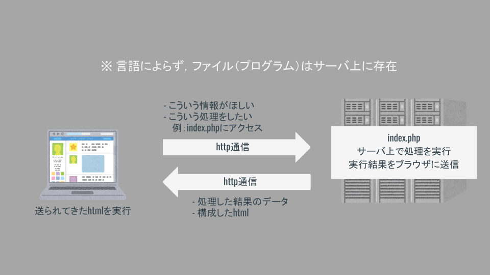

# サーバ編 ②（Node.js）

## 今回のゴール

- Supabase を用いたデータの永続化を実装する．

- 「todo リスト」を実装し，CRUD 処理とデータの構造を把握する．

- Slack と連携する処理を実装する．

## サーバ - クライアント型のアプリケーション

### サーバで動作する言語（サーバサイド）

サーバ上でプログラムが実行される．

- PHP

- Ruby

- Python

- JAVA

- Node.js

- etc...

## サーバサイドの役割

様々な Web アプリケーションが存在するが，基本のサーバサイド処理は同様である．

基本の機能は何らかのデータを扱うことである．

### 例

- twitter => ツイート，検索，タイムラインの表示，etc

- facebook => 投稿，検索，記事の更新，コメント，etc

- wordpress => ブログ記事の投稿，編集，削除，etc

### 💡 Key Point

> 上記の処理は以下の 4 つに集約される．
>
> - 📝 データの「作成」（Create）
>
> - 📖 データの「参照」（Read）
>
> - 🔄 データの「更新」（Update）
>
> - 🗑 データの「削除」（Delete）

これら 4 種類の処理の頭文字をとって「CRUD」と呼ぶ．
