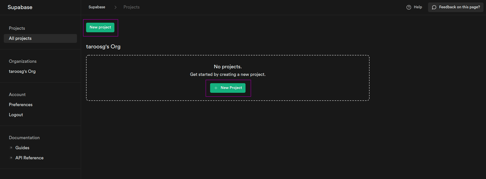
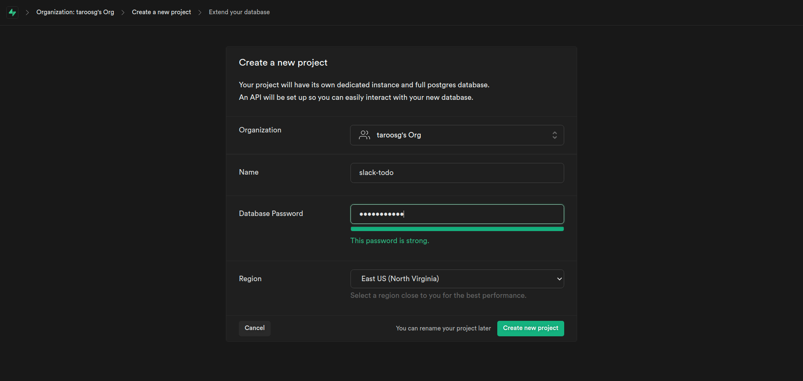
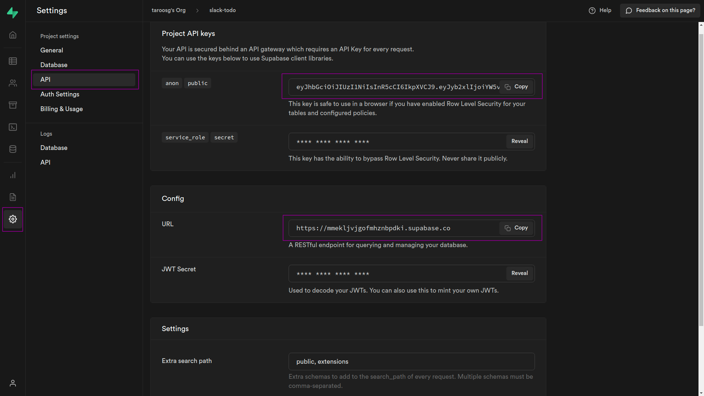

# Supabase の準備

## Supabase の準備

今回は NoSQL である Supabase を用いて CRUD 処理を実装してみる．

DB がオンライン上にあるので，環境問わず使えるところが魅力．

## DB の作成

### プロジェクト作成

Supabase のコンソール（[https://app.supabase.io/](https://app.supabase.io/)）にアクセスし，GitHub アカウントでサインインする．

「New project」をクリックし，project を作成する．



プロジェクト名と DB アクセス用パスワードを設定する．面倒なパスワードを作成しないといけないので注意．

> パスワードの条件はよくわからないが，以下の文字列でクリアできる．
>
> `QwertyZxcvbn102938-_`



### テーブルの作成

「左側の Table アイコン」→「Create a new table」の順にクリックし，テーブルを作成する．

テーブル名：`todo_table`

カラム：以下のとおり設定

| Name         | Type         | 備考                |
| ------------ | ------------ | ------------------- |
| `id`         | `int8`       | 初期設定のまま      |
| `user_id`    | `int8`       | 追加                |
| `todo`       | `varchar`    | 追加                |
| `deadline`   | `date`       | 追加                |
| `is_done`    | `bool`       | 初期値は `false`    |
| `created_at` | `timestampz` | 初期設定のまま      |
| `updated_at` | `timestampz` | `created-at` と同様 |

## Node.js 側の準備

まず適当な場所で以下のコマンドを実行する．`express-202203` はプロジェクトのディレクトリ名なので各自で設定して OK．

```bash
$ mkdir express-202203
$ cd express-202203
$ npm init -y
```

`express-202203` ディレクトリをエディタで開き，今回の実装で必要なディレクトリとファイル（以下）を作成しておく．

- `app.js`

- `routes/todo.route.js`

- `controllers/todo.controller.js`

- `services/todo.service.js`

- `repositories/todo.repository.js`

下記のような構成となっていれば OK！

```bash
.
├── app.js
├── controllers
│   └── todo.controller.js
├── package.json
├── routes
│   └── todo.route.js
├── repositories
│   └── todo.repository.js
└── services
    └── todo.service.js

```

## `package.json` の編集

下記 2 点の内容を追記する．

```json
"type": "module",
```

↓ こちらは `"scripts"` 内に記述する．

```json
"start": "node app.js",
```

追記後は以下のような状態．

```json
{
  "name": "express-202203",
  "version": "1.0.0",
  "type": "module",
  "description": "",
  "main": "index.js",
  "scripts": {
    "start": "node app.js",
    "test": "echo \"Error: no test specified\" && exit 1"
  },
  "author": "",
  "license": "ISC"
}
```

> **💡 Key Point**
>
> `package.json`に`"type": "module"`を追記することで`import`形式で別ファイルを読みこむことができる．
> この追記を行わない場合，外部ファイルを読み込む際には`require()`関数を用いる．
> React などでは`import`が基本となっており，こちらに揃えておいたほうがメリットが大きくオススメである．

## Node.js と Supabase の連携

1. Supabase の管理画面から「`⚙`」→「`API`」の順にクリックする．
2. `Project API keys` と `Config` の `URL` が必要になるので確認する．



3. プロジェクト直下に `.env` ファイルを作成し，以下の内容を記述する．これらの情報は機密情報なので環境変数を用いて管理する．

```txt
SUPABASE_API_KEY=`2で確認したAPI key`
SUPABASE_URL=`2で確認したURL`
```

4. 以下のコマンドを実行し，環境変数を使用するためのライブラリをインストールする．

```bash
$ npm i dotenv
```

5. プロジェクト直下に `.gitignore` を作成し，に以下の内容を追記して `.env` ファイルを Git 管理外にする．

```
/node_modules
.env
```

6. 下記コマンドを実行し，Node.js から Supabase を扱うためのライブラリをインストールする．

```bash
$ npm i @supabase/supabase-js
```

ここまででアプリケーションと Supabase を連携させる準備は完了．
