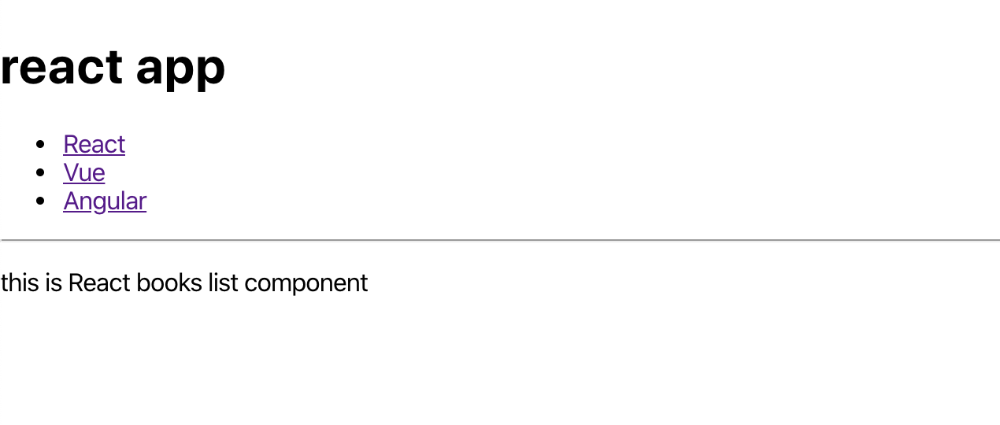

# 子コンポーネントへの関数入力

ページごとにコンポーネントを表示できたので，それぞれのページでキーワードから本のデータを取得したい．

子コンポーネントで関数を定義してもよいが，今回は `App.jsx` で関数を定義して子コンポーネントに渡す（関数の渡し方の練習）．

## 関数の定義を `props` の 1 つとして渡す

`App.jsx` を以下のように編集する

```jsx
// App.jsx

import { Booklist } from "./components/Booklist";
import { BrowserRouter, Routes, Route, Link } from "react-router-dom";

const App = () => {
  // 🔽 関数を追加
  const getDataFromAPI = (keyword) => {
    return `${keyword} books`;
  };

  const languages = ["React", "Vue", "Angular"];
  return (
    // 🔽 1つ目のコンポーネントに関数を渡す
    <BrowserRouter>
      <h1>react app</h1>
      <ul>
        <li>
          <Link to="/react">React</Link>
        </li>
        <li>
          <Link to="/vue">Vue</Link>
        </li>
        <li>
          <Link to="/angular">Angular</Link>
        </li>
      </ul>
      <hr />
      <Routes>
        <Route
          path="/react"
          element={
            <Booklist language={languages[0]} getData={getDataFromAPI} />
          }
        />
        <Route path="/vue" element={<Booklist language={languages[1]} />} />
        <Route path="/angular" element={<Booklist language={languages[2]} />} />
      </Routes>
    </BrowserRouter>
  );
};
export default App;
```

ここでは「`getData`」という名前で「keyword を入力すると `getDataFromApi(keyword)` を実行する関数」を「`Booklist` コンポーネント」に渡している．

## props からの受け取りと関数の実行

続いて，`Booklist` コンポーネントで関数を受け取って実行する．

子コンポーネントで，読み込み時に渡された関数を実行してその結果を要素に反映する．

```jsx
// Booklist.jsx

// 🔽 propsを追加
export const Booklist = ({ language, getData }) => {
  // 🔽 関数を実行（`?` を使用することで，`getData` が存在する場合のみ関数を実行可能）
  const result = getData?.(language);

  return (
    <>
      <p>this is {result} list component</p>
    </>
  );
};
```

ブラウザで確認すると「react books」のように表示がされていることがわかる．`Vue` と `Angular` の部分は関数を渡していないので表示がされない状態で OK．



ここまでうまく行ったら，`App.jsx` 内の `<Route>` 要素残り 2 つも同様に追記しよう．

```jsx
// App.jsx

import { Booklist } from "./components/Booklist";
import { BrowserRouter, Route, Link } from "react-router-dom";

const App = () => {
  const getDataFromAPI = (keyword) => {
    return `${keyword} books`;
  };

  const languages = ["React", "Vue", "Angular"];
  return (
    <BrowserRouter>
      <h1>react app</h1>
      <ul>
        <li>
          <Link to="/react">React</Link>
        </li>
        <li>
          <Link to="/vue">Vue</Link>
        </li>
        <li>
          <Link to="/angular">Angular</Link>
        </li>
      </ul>
      <hr />
      <Routes>
        <Route
          path="/react"
          element={
            <Booklist language={languages[0]} getData={getDataFromAPI} />
          }
        />
        <Route
          path="/vue"
          element={
            <Booklist language={languages[1]} getData={getDataFromAPI} />
          }
        />
        <Route
          path="/angular"
          element={
            <Booklist language={languages[2]} getData={getDataFromAPI} />
          }
        />
      </Routes>
    </BrowserRouter>
  );
};
export default App;
```

ブラウザで操作し，うまくいけば OK．これで親コンポーネントで定義した関数を子コンポーネントに渡すことができた．
