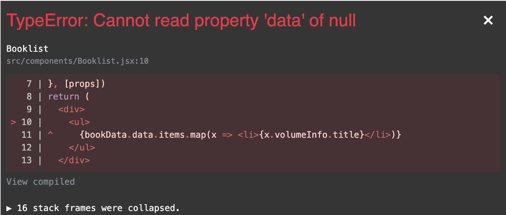

# 表示の調整

現状では取得したデータを全て文字列で表示しているだけなので，書籍のタイトルがリスト表示されるよう整える．

booksData から必要なデータを取り出して `map()` 関数で `<li>` タグをつくる．

```jsx
// Booklist.jsx

import { useState, useEffect } from "react";

export const Booklist = ({ language, getData }) => {
  const [bookData, setBookData] = useState(null);

  useEffect(() => {
    const result = getData?.(language).then((response) =>
      setBookData(response)
    );
  }, [language, getData]);

  // 🔽 データからタグを生成する処理を追加
  return (
    <ul>
      {bookData.data.items.map((x, index) => (
        <li key={index}>{x.volumeInfo.title}</li>
      ))}
    </ul>
  );
};
```

ブラウザで表示を確認するとエラーになる．



> 【補足】
>
> 現在の最新バージョンでは上記エラー画面が表示されない．コンソールにエラーメッセージが表示されるので，検証画面を確認しよう．

このエラーの原因は，まだ API からデータを取得していない状態でレンダリングしようとして `map()` 関数が実行されているためである．`map()` 関数は配列に対して処理を行う関数だが，配列のデータが存在しない状態で実行しようとしているためエラーとなる．

三項演算子を使用して，`bookData` の有無で表示を切り替えることで回避できる．

- `bookData` が `null` の場合はローディング中のメッセージを表示．

- データが取得できたらリスト表示に切り替え．

```jsx
// Booklist.jsx

import { useState, useEffect } from "react";

export const Booklist = ({ language, getData }) => {
  const [bookData, setBookData] = useState(null);

  useEffect(() => {
    const result = getData?.(language).then((response) =>
      setBookData(response)
    );
  }, [language, getData]);

  return (
    <ul>
      {bookData === null ? (
        <p>now loading...</p>
      ) : (
        bookData.data.items.map((x, index) => (
          <li key={index}>{x.volumeInfo.title}</li>
        ))
      )}
    </ul>
  );
};
```

このように表示されれば OK！


リンククリックするとリストも切り替わる挙動になっている（はず）．

> **💡 Key Point**
>
> このように，React ではデータの取得とレンダリングのタイミングなどでハマることが多い．
>
> まずはエラーをよく読むことと，目的のデータが存在しているかどうか，どんな形のデータになっているのかを確認しながら進めると良い．

## 参考

上記の問題は optional chaining でも回避可能．

```jsx
<ul>
  {bookData?.data.items.map((x, index) => (
    <li key={index}>{x.volumeInfo.title}</li>
  ))}
</ul>
```
