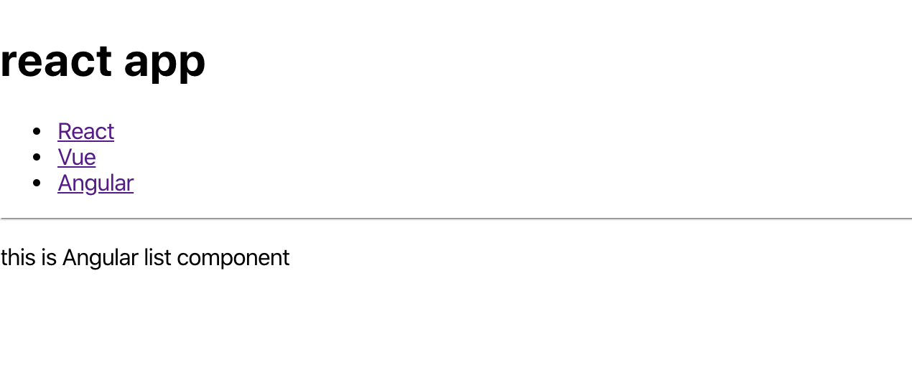

# router 機能

実際の web アプリケーションでは，処理ごとにページを分けて行いたい場合が多い．

ここまでの実装では，1 つのページに全てのコンポーネントを表示していたが，本項ではコンポーネントを別ページで表現する．そのままの記述ではページ遷移が行えないので，新しく `react-router` のライブラリをインストールする．

## `react-router` のインストール

ターミナルで**作業ディレクトリにいることを確認**し，下記コマンドを実行する．

```bash
$ npm install react-router-dom
```

> 【解説】ルーティング
>
> - 通常，React で web アプリケーションを実装すると，コンポーネントが切り替わっても URL は変化しない．
>
> - この 2 つを関連づけて，URL からアプリ内の特定のコンポーネントにアクセスできるようにしたり，逆にアプリ内での状態変化を URL に反映させたりすることをルーティングと呼ぶ．
>
> - ルーティングしておくと，ブラウザの戻るボタンで戻ったり，URL を打って特定のページに直接アクセスできたりするのでいい感じになる．

> **【注意】**
>
> `react-router` はバージョンが 5 から 6 にアップデートされたタイミングで記述方法が変更された部分がある．ドキュメントはバージョン 6 のものを確認すること．

## ルーティングの定義

`react-router`の機能を用いてルーティングを実装する．

`App.jsx`を以下のように編集する．

```jsx
// App.jsx

import Booklist from "./components/Booklist";
// 🔽 追加
import { BrowserRouter, Routes, Route } from "react-router-dom";

const App = () => {
  const languages = ["React", "Vue", "Angular"];
  return (
    // 🔽 編集
    <BrowserRouter>
      <h1>react app</h1>
      <Routes>
        <Route path="/react" element={<Booklist language={languages[0]} />} />
        <Route path="/vue" element={<Booklist language={languages[1]} />} />
        <Route path="/angular" element={<Booklist language={languages[2]} />} />
      </Routes>
    </BrowserRouter>
  );
};
export default App;
```

- `<BrowserRouter>` の中に `<Routes>` と `<Route>` を置き，`path` に対応させたい URL を，`element` に描画したいコンポーネントを渡す．

- `element` 内にコンポーネントを記述した場合でも `props` の渡し方は同様である．

> **💡 Key Point**
>
> router 機能を使用したい場合は，コンポーネントを必ず `<BrowserRouter>` 内に配置すること．

ブラウザで`localhost:3000/vue`などと URL を入力して表示を確認しよう．


## リンクを貼る

- 毎回 URL 入力はダルい．

- せっかくルーティングを実装したので，リンクを張ってブラウザ上で移動できるようにしたい．

- `react-router` の `Link` 機能を使うと簡単にリンクを作成できる．

`App.jsx`を以下のように編集する．

```jsx
// App.jsx

import { Booklist } from "./components/Booklist";
// 🔽 Link を追加
import { BrowserRouter, Routes, Route, Link } from "react-router-dom";

const App = () => {
  const languages = ["React", "Vue", "Angular"];

  return (
    // 🔽 編集
    <BrowserRouter>
      <h1>react app</h1>
      <ul>
        <li>
          <Link to="/react">React</Link>
        </li>
        <li>
          <Link to="/vue">Vue</Link>
        </li>
        <li>
          <Link to="/angular">Angular</Link>
        </li>
      </ul>
      <hr />
      <Routes>
        <Route path="/react" element={<Booklist language={languages[0]} />} />
        <Route path="/vue" element={<Booklist language={languages[1]} />} />
        <Route path="/angular" element={<Booklist language={languages[2]} />} />
      </Routes>
    </BrowserRouter>
  );
};
export default App;
```

`<Link>` タグの `to` 部分に移動したい URL を書いておくと，`<a>` タグのようにリンクしてくれる．

ブラウザ画面で移動できることを確認しよう．


